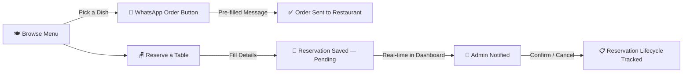

<div align="center">


<br/>

[](https://github.com/Nayeem131136/kansari-restaurant)
&nbsp;
[](https://vercel.com)
&nbsp;
[](https://supabase.com)
&nbsp;
[](https://react.dev)
&nbsp;
[](LICENSE)

<br/>


</div>

---

## 📖 About

**KANSARI** is a modern, editorial-style website for a contemporary Bangladeshi restaurant in Mohammadpur, Dhaka. The site pairs a premium customer-facing menu and reservation experience with a **WhatsApp-powered ordering flow** — no payment gateway required. Customers browse the full menu, and every dish opens a pre-filled WhatsApp message straight to the restaurant. A Supabase-backed admin dashboard manages the live menu, categories, gallery, reviews, reservations, and restaurant settings.

> *"স্বাদের শিকড়, নতুন এক আয়োজন।"*

---

## ✨ Key Features

<div align="center">

| Feature | Description |
|---|---|
| 🍽️ **Dynamic Menu System** | Categories & dishes managed live from the admin panel — name, Bengali name, price, photo, tags, availability |
| 💬 **WhatsApp Ordering** | Every dish has an "অর্ডার করুন" button that opens WhatsApp with a pre-filled order message; a floating WhatsApp button is always available |
| 🪑 **Table Reservation System** | Public booking form (name, phone, date, time, guests) with admin-side status tracking (Pending → Confirmed → Completed / Cancelled / No-show) |
| 🖼️ **Gallery with Lightbox** | Keyboard-accessible lightbox gallery of the dining room, kitchen, and dishes |
| ⭐ **Review Management** | Admin can add, edit, publish/unpublish customer reviews shown on the site |
| 📊 **Admin Dashboard** | Booking volume charts, today's covers, activity log, and quick actions |
| 🔐 **JWT Admin Auth** | Single gated admin login, bcrypt-hashed password, Supabase Row Level Security on all tables |
| ☁️ **Persistent Cloud Storage** | Admin-uploaded images go straight to Supabase Storage — no local disk dependency, safe on serverless hosting |
| 🎨 **Editorial Bengali/English UI** | Warm, premium restaurant aesthetic with scroll-reveal micro-animations and a custom cursor |

</div>

---

## 🛠️ Tech Stack

<div align="center">


</div>

---

## 🏗️ Project Structure

```
kansari-restaurant/
├── 🎨 src/
│   ├── components/
│   │   ├── sections/         # Navbar, Hero, InteractiveMenu, Gallery, Reservation, Footer...
│   │   ├── admin/             # AdminLogin, AdminDashboard, Menu/Reservations/Gallery views
│   │   └── ui/                 # FloatingWhatsApp, CustomCursor, ScrollProgress, PageIntro
│   ├── context/                # AuthContext, RestaurantContext, ToastContext
│   ├── config/                 # data.ts — offline fallback content
│   ├── lib/                    # api.ts client, utils
│   └── types/                  # admin.ts — shared data models
├── 🖥️ server/
│   ├── routes/                 # auth, menu, reservations, gallery, reviews, restaurant, upload
│   ├── db.ts                   # Supabase (Postgres) data layer
│   ├── supabaseClient.ts
│   └── app.ts                  # shared Express app (local dev + Vercel)
├── 🗄️ schema.sql                # Database tables (run once in Supabase)
├── 🗄️ seed.sql                  # Real menu, gallery, review seed data
├── api/index.ts                # Vercel serverless entry point
└── vercel.json
```

---

## 🔄 How It Works



---

## ⚙️ Installation & Setup

```bash
# 1. Clone the repository
git clone https://github.com/Nayeem131136/kansari-restaurant.git
cd kansari-restaurant

# 2. Install dependencies
npm install

# 3. Add your environment variables (create a .env file)
JWT_SECRET=your_long_random_secret
SUPABASE_URL=your_supabase_project_url
SUPABASE_SERVICE_ROLE_KEY=your_supabase_service_role_key

# 4. Set up the database — in Supabase SQL Editor, run:
#    schema.sql, then seed.sql

# 5. Run locally
npm run dev
```

---

## 🚀 Deploy Your Own

```bash
# Push to GitHub
git init
git add .
git commit -m "Initial commit: KANSARI"
git branch -M main
git remote add origin https://github.com/Nayeem131136/kansari-restaurant.git
git push -u origin main
```

Then on **[vercel.com/new](https://vercel.com/new)**:
1. Import the `kansari-restaurant` repo
2. Add the three environment variables under Project Settings → Environment Variables
3. Click **Deploy** 🚀

Every push to `main` auto-redeploys. The build targets Vercel's serverless Node runtime out of the box via `vercel.json`.

---

## 🧭 Usage

| Step | Action |
|---|---|
| 1️⃣ | Customer browses the Menu, filters by category or searches a dish |
| 2️⃣ | Clicks **"হোয়াটসঅ্যাপে অর্ডার করুন"** on any dish — WhatsApp opens pre-filled with the order |
| 3️⃣ | Or fills the **Reservation** form — name, phone, date, time, guest count |
| 4️⃣ | Reservation is saved as Pending, confirmation follows by phone/WhatsApp |
| 5️⃣ | Admin logs into `/#admin`, sees the new reservation on the Dashboard |
| 6️⃣ | Admin confirms/cancels the booking, manages menu items, gallery, and reviews |

---

## 🗺️ Roadmap

- [ ] Full cart + checkout system with bKash/Nagad payment integration
- [ ] QR-code table menu for in-restaurant ordering
- [ ] Bengali/English full language toggle
- [ ] Delivery zone & charge calculator
- [ ] Customer loyalty / discount code system

---

## 👤 Developer

<div align="center">

| Name | Role | GitHub |
|---|---|---|
| **Md. Mahdi Hasan Nayeem** | 🏆 Creator & Developer | [@Nayeem131136](https://github.com/Nayeem131136) |

**Portfolio:** [mahdi-hasan-nayeem-portfolio.vercel.app](https://mahdi-hasan-nayeem-portfolio.vercel.app/)

</div>

---

<div align="center">


**⭐ Star this repo if it helped you! | 🍴 Fork to build your own**

[](https://github.com/Nayeem131136/kansari-restaurant/stargazers)
&nbsp;
[](https://github.com/Nayeem131136/kansari-restaurant/network/members)

*Built with 🖤 by Md. Mahdi Hasan Nayeem*

</div>
